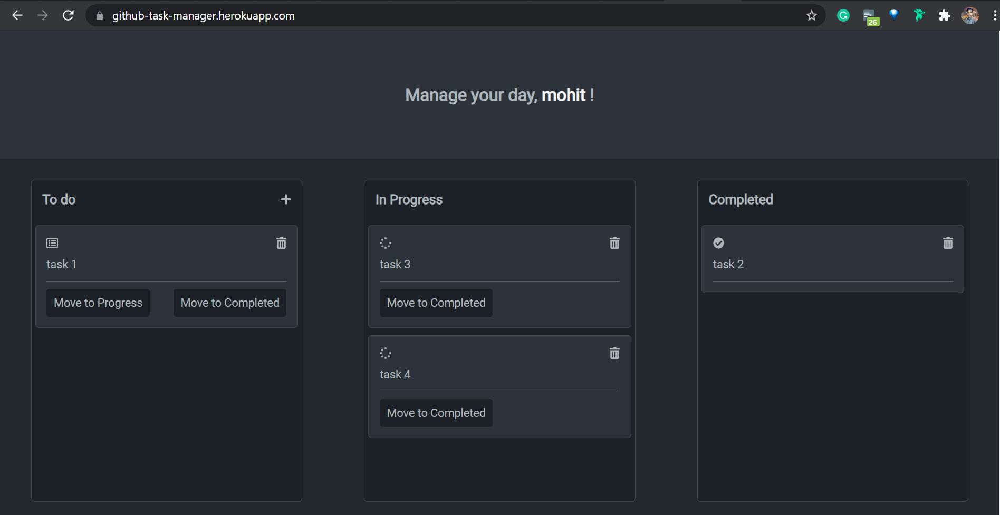

# task-manager

<h3>Project details( link: https://github-task-manager.herokuapp.com/)</h3>

Created a task manager web application that is quite similar to github project manager. it has an authentication system for every user and all your changes sync with the database so whether you refresh your browser or close your window, you're not going to lose your data and will start from where you left your task.
 
apart from that, i have integrated add a new task feature, delete the task and move the current task to progress or a completed section

<strong>Tools used</strong> : Node.js, Express.js as backend and Mongo Db as a database, javascript,HTML and CSS on client side</h4>
<h3>Screenshots:

### thanks !!